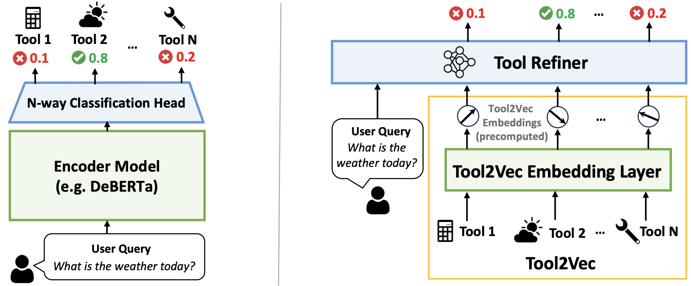

# Efficient and Scalable Estimation of Tool Representations in Vector Space
<!--- BADGES: START --->
[][#arxiv-paper-package]
[][#license-gh-package]

[#license-gh-package]: https://lbesson.mit-license.org/
[#arxiv-paper-package]: https://arxiv.org/abs/2409.02141
<!--- BADGES: END --->



Efficient and scalable tool retrieval is critical for modern function calling applications. We propose novel approaches to the tool retrieval problem: (1) Tool2Vec: usage-driven tool embedding generation for tool retrieval, (2) ToolRefiner: a staged retrieval method that iteratively improves the quality of retrieved tools, and (3) MLC: framing tool retrieval as a multi-label classification problem. With these new methods, we achieve improvements of up to 27.28 in Recall@K on the ToolBench dataset. Furthermore, we introduce ToolBank, a set of domain-specific tool retrieval datasets to encourage further research. For more details, please check out our paper [here](https://arxiv.org/abs/2409.02141).

---
## Installation

1. Create a conda environment and install the dependencies
```
conda create --name ToolRAG python=3.10 -y
conda activate ToolRAG
```

2. Clone and install the dependencies
```
git clone https://github.com/SuhongMoon/ToolRAG.git
cd ToolRAG
pip install -e .
pip install -r requirements.txt
```
---

## Download ToolBank Dataset
1. Install HuggingFace `datasets` package
```
pip install datasets
```

2. Load the dataset from HuggingFace
```python
from datasets import load_dataset

tool_bank = load_dataset("squeeze-ai-lab/ToolBank")
```

---
## Basic Runs

### Generate Synthetic Data
Refer to `toolrag/data_generation/README.md` for more details [here](toolrag/data_generation/README.md).

### Fine Tuning Embedding Models
Refer to `toolrag/query2query/README.md` for more details [here](toolrag/query2query/README.md).

### Generate Tool2Vec Embeddings
Refer to `toolrag/tool2vec/README.md` for more details [here](toolrag/tool2vec/README.md).

### Train MLC Model
Refer to `toolrag/mlc/README.md` for more details [here](toolrag/mlc/README.md).

### Train ToolRefiner Model
Refer to `toolrag/toolrefiner/README.md` for more details [here](toolrag/toolrefiner/README.md).

## Citation
